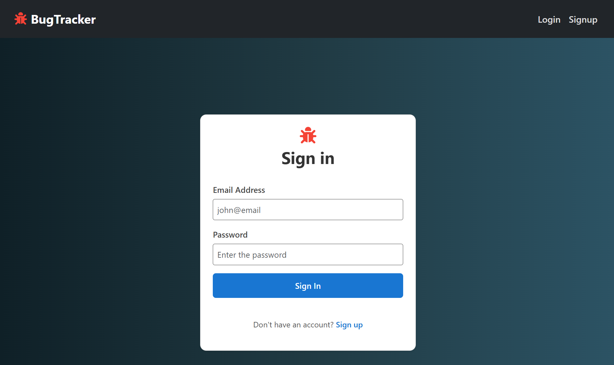

# 🐞 Bug Tracker

A comprehensive Bug Tracking System built with the **MERN stack (MongoDB, Express.js, React.js, Node.js)**. This application enables development teams to efficiently manage software projects, track bugs, assign tasks, and monitor progress through an intuitive web interface.

---

## ✨ Features

- 👥 **Role-Based Access Control**: Distinct Admin and Developer user roles
- 📁 **Project Management**: Create, organize, and assign projects to team members
- 🎫 **Advanced Ticket System**: Create, update, assign, and resolve bug tickets
- 💬 **Real-time Comments**: Collaborative communication between admins and developers
- 📈 **Status Tracking**: Visual progress monitoring (To Do → In Progress → Done)
- 🔒 **Secure Authentication**: JWT-based login and registration system
- ⏰ **Activity Timestamps**: Track creation and update times for all activities
- 📱 **Responsive Design**: Mobile-friendly interface using Bootstrap 5
- 🎯 **Task Assignment**: Assign specific tickets to developers
- 📊 **Dashboard Analytics**: Overview of project and ticket statistics

---

## 🛠️ Tech Stack

| Technology       |         Purpose                   |
|------------------|-----------------------------------|
| **MongoDB**      | NoSQL database for data storage   |
| **Express.js**   | Backend web framework             |
| **React.js**     | Frontend user interface           |
| **Node.js**      | Backend runtime environment       |
| **Bootstrap 5**  | CSS framework for styling         |
| **JWT**          | Authentication & authorization    |
| **Axios**        | HTTP client for API requests      |

---
### 📸 Screenshots
| Admin Dashboard | Developer View |
|-----------------|----------------|
|  |  |

| Login | Register |
|-----------------|----------------|
|  |  |

**Project Tickets**


**Ticket**


---

## 🚀 Getting Started

### Prerequisites

- Node.js (v14 or higher)
- MongoDB (local installation or MongoDB Atlas account)
- npm or yarn package manager

### Installation

1. **Clone the repository**
   ```bash
   git clone https://github.com/AshishSinsinwal/bugTracker.git
   ```

2. **Set up the backend**
   ```bash
   cd Server
   npm install
   ```

3. **Configure environment variables**
   
   Create a `.env` file in the `server` directory:
   ```env
   PORT=8000
   MONGO_URI=your_mongodb_connection_string
   JWT_SECRET=your_jwt_secret_key
   ```

4. **Start the backend server**
   ```bash
   npm run dev
   ```

5. **Set up the frontend**
   ```bash
   cd ../bug-tracker-frontend
   npm install
   ```

6. **Start the frontend application**
   ```bash
   npm start
   ```

The application will be available at `http://localhost:8000`

---

## 📁 Project Structure

```
bug-tracker/
├── client/                 # React frontend
│   ├── public/
│   ├── src/
│   │   ├── components/     # Reusable UI components
│   │   ├── pages/          # Page components
│   │   ├── services/       # API service functions
│   │   ├── context/        # React context providers
│   │   └── App.js          # Main application component
│   └── package.json
├── server/                 # Express backend
│   ├── models/             # MongoDB schemas
│   ├── routes/             # API route definitions
│   ├── controllers/        # Request handlers
│   ├── middleware/         # Custom middleware
│   ├── config/             # Configuration files
│   └── server.js           # Server entry point
└── README.md
```

---

## 👥 User Roles & Permissions

### 🔧 Admin
- Create and manage projects
- Assign developers to tickets
- Create, edit, and delete bug tickets
- Manage user accounts

### 💻 Developer
- View tickets
- Update ticket status (To Do → In Progress → Done)
- Add comments and updates to tickets
- Track personal task progress

---

## 🎯 Core Functionality


### Ticket System
- Create detailed bug reports with priority levels
- Assign tickets to specific developers
- Track ticket lifecycle from creation to resolution
- Add comments and status updates

### Authentication
- Secure user registration and login
- JWT token-based session management
- Role-based route protection

---

## 🔮 Future Enhancements

- [ ] **Email Notifications**: Automated alerts for ticket assignments and updates
- [ ] **File Attachments**: Upload screenshots and documents to tickets
- [ ] **Advanced Filtering**: Filter tickets by priority, status, assignee, and date
- [ ] **Activity Dashboard**: Comprehensive logging of all user activities
- [ ] **Dark Mode**: Toggle between light and dark themes
- [ ] **Mobile App**: Native mobile application for iOS and Android
- [ ] **Integration APIs**: Connect with GitHub, Jira, and other development tools
- [ ] **Reporting**: Generate PDF reports for project progress
- [ ] **Time Tracking**: Track time spent on each ticket

---

## 🤝 Contributing

Contributions are welcome! Please feel free to submit a Pull Request. For major changes, please open an issue first to discuss what you would like to change.

1. Fork the project
2. Create your feature branch (`git checkout -b feature/AmazingFeature`)
3. Commit your changes (`git commit -m 'Add some AmazingFeature'`)
4. Push to the branch (`git push origin feature/AmazingFeature`)
5. Open a Pull Request

---

## 📄 License

This project is licensed under the MIT License - see the [LICENSE](LICENSE) file for details.

---

## 👨‍💻 Author

**Your Name**
- GitHub: [Ashish Sinsinwal](https://github.com/AshishSinsinwal)
- LinkedIn: [Ashish Sinsinwal](https://www.linkedin.com/in/ashish-sinsinwal-a31b48318)

---

## 🙏 Acknowledgments

- Thanks to the MERN stack community for excellent documentation and resources
- Bootstrap team for the responsive CSS framework
- MongoDB for providing an excellent NoSQL database solution

---

*Built with ❤️ using the MERN stack*